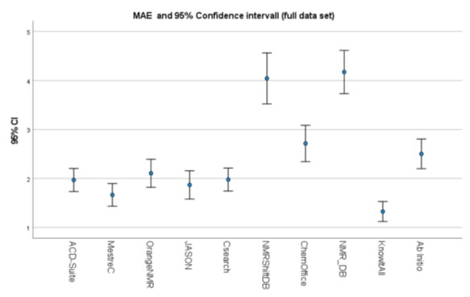
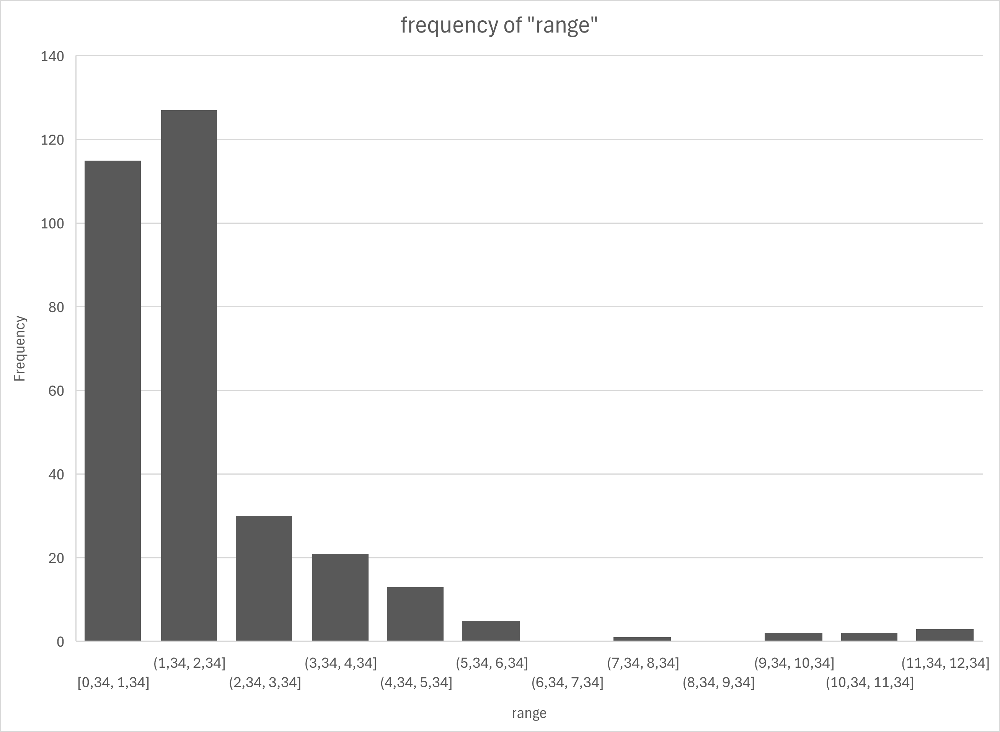
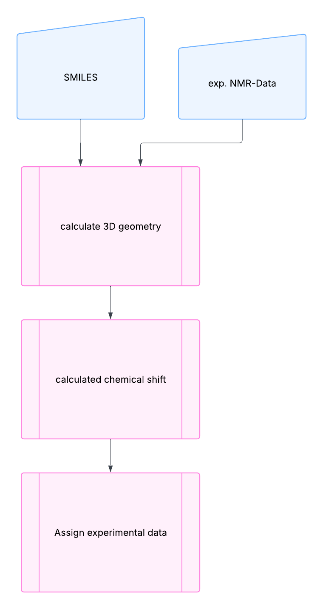

# Chapter 1

**Whatever you always wanted to know about the ^13^C chemical shift but were too afraid to ask!**

In the years 2022-2023, I examined a variety of available programs and methods for calculating the ^13^C chemical shift ( *a more detailed discussion comes later*). For some of the data, I was able to compare it with my tests from the late 1990s [1]. Fortunately, I still possessed the test results. 

The following image shows the MAE and the 95% confidence interval for the entire dataset. Five of the tested programs are in the range of around 2 ppm for the mean error. The better performance of KnowItAll is due to the large data set and the resulting advantage in the tests. An important insight in this context is that most calculation methods seem to achieve a mean error of 2 ppm. Therefore, it is important to remember this value for further discussions.

In connection with these tests, I also examined the approach published by [Tantillo](http://cheshirenmr.info/) for calculating the chemical shift from theoretically calculated data [2-7]. I also took a closer look at the underlying experimental data and verified it using data from the [NMRShiftDb](https://nmrshiftdb.nmr.uni-koeln.de/) and the [SDBS database](https://sdbs.db.aist.go.jp/). It was noticeable that the published chemical shifts of a compound can indeed exhibit considerable fluctuations. I found as largest range for ^13^C chemical shift a range of 2.24ppm and 2.41ppm for ^1^H in this cases.

I wanted to gain a broader overview of the reproducibility of published 13C chemical shift data. For this, I selected three publications that deal with impurities in NMR solvents [8-10]. I extracted the relevant data from these publications, transferred it to an [Excel file](13C-Spannweiten.xlsx), and then examined it more closely. A maximum range was found at 11.94ppm for the carbonyl carbon-atom in acetone. The next picture shows the frequency of this ranges given in ppm:

In the most cases this range is lower than 2.4 ppm (We remember the results from the tests from the beginning of this page).

In my opinion a mean averaged error of around 2.5 ppm look like acceptable for ^13^C chemical shift calculation. 

# My dream

This flowchart illustrates my vision for a simple, fast, and accurate method to assign the experimental 13C chemical shifts of a given organic compound.

In the following, I will present my attempts at the theoretical calculation of 13C chemical shifts. These works are still ongoing, and I will continually expand and update the chapter. I have also presented the status as of February 2025 in the presentation linked below. Therefore, I have included it in this collection.

**Two key areas warrant further investigation:**

1. **Geometry Optimization Efficiency**
    As the most time-consuming step in these calculations:
   - What impact does molecular geometry have on achieving results with acceptable accuracy?
2. **Shielding-to-Shift Conversion Methodology**
    Which approach is more effective for converting anisotropic shielding to 13C chemical shifts:
   - **Option A:** Using a reference substance (e.g., TMS)
   - **Option B:** Regression methods (as proposed by Tantillo et al.)

**Data Sources and Tools:**
 Experimental data and DFT geometries were sourced from the [CASCADE GitHub repository](https://github.com/patonlab/CASCADE):

- **Experimental Data**: Extracted from `NMR8K.sdf` (76 organic compounds randomly selected).
- **DFT Geometries**: Obtained from `DFT-geometries.sdf`. Three geometries were unavailable; 73 were successfully extracted and utilized.

[pyscf](https://github.com/pyscf) and gpu4pyscf - a python module for quantum chemistry and a version for usage on NVIDIA gpu‘s using CUDA 11.x or CUDA 12.x.

[rdkit](https://github.com/rdkit/rdkit)[/](https://github.com/rdkit/rdkit)[rdkit](https://github.com/rdkit/rdkit)[: The official sour.es for the ](https://github.com/rdkit/rdkit)[RDKit](https://github.com/rdkit/rdkit)[ library](https://github.com/rdkit/rdkit).

Jupyter notebook .

And some other libraries for special tasks. Normally i have moved all import commands to the top of each jupyter notebook. 

## Testcases

[Testcase 1](testcase-1.md)- Universal force field was used for geometry calculation

[Testcase 2](testcase-2.md) - Merck forcefield was used for geometry calculation

[Testcase 3](testcase-3.md)-  DFT geometries from CASCADE was used.

<u>Materials</u>

[presentation](Whatever_you_always-10.2.25.pptx)

[13C ranges](13C-Spannweiten.xlsx)

<u>Sources</u>

[1] Thomas, St., Kleinpeter, E., Brühl, I., & Heilmann, D. (1997). 13 C NMR Chemical Shift Calculations for Some Substituted Pyridines: A Comparative Consideration †. *Journal of Chemical Information and Computer Sciences*, *37*(4), 726–730. https://doi.org/10.1021/ci970440i

[2] Lodewyk, M. W.; Siebert, M. R.; Tantillo, D. J. *Chem. Rev.* **2012**, *112*, 1839-1862.

[3] Lodewyk, M. W.; Soldi, C.; Jones, P. B.; Olmstead, M. M.; Larrucea, J. R.; Shaw, J. T.; Tantillo, D. J. *J. Am. Chem. Soc.* **2012**, *134,* 18550-18553.

[4] Lodewyk, M. W.; Tantillo, D. J. *J. Nat. Prod.* **2011**, *74*, 1339-1343.

[5] Bally, T.; Rablen, P. R. *J. Org. Chem.* **2011**, *76*, 4818-4830.

[6] Jain, R. J.; Bally, T.; Rablen, P. R. *J. Org. Chem.* **2009**, *74*, 4017-4023.

[7] Rablen, P. R.; Pearlman, S. A.; Finkbiner, J. *J. Phys. Chem. A* **1999**, *103*, 7357-7363.

[8] Organometallics 2010, 29, 2176–2179, DOI: 10.1021/om100106e, NMR Chemical Shifts of Trace Impurities: Common Laboratory Solvents, Organics, and Gases in Deuterated Solvents Relevant to the Organometallic Chemist; Gregory R. Fulmer, Alexander J. M. Miller, Nathaniel H. Sherden, Hugo E. Gottlieb, Abraham Nudelman, Brian M. Stoltz, John E. Bercaw, and Karen I. Goldberg

[9] J. Org. Chem. 1997, 62, 7512—7515, NMR Chemical Shifts of Common Laboratory Solvents as Trace Impurities; Hugo E. Gottlieb, Vadim Kotlyar, and Abraham Nudelman

[10] NMR Chemical Shifts of Trace Impurities: Industrially Preferred Solvents Used in Process and Green Chemistry; Nicholas R. Babij, Elizabeth O. McCusker, Gregory T. Whiteker, Belgin Canturk, Nakyen Choy, Lawrence C. Creemer, Carl V. De Amicis, Nicole M. Hewlett, Peter L. Johnson, James A. Knobelsdorf, Fangzheng Li, Beth A. Lorsbach, Benjamin M. Nugent, Sarah J. Ryan, Michelle R. Smith, and Qiang Yang

