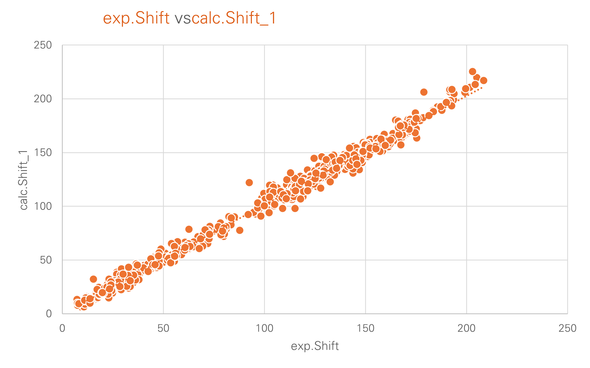

# Testcase 2

### MMFF geometries / DFT shieldings

<u>Workflow:</u>

•Geometry optimisation: Merck forcefield as implemented in rdkit

•NMR: Shieldings using pyscf and B3LYP/6-31G*

•Calibration

​	•CSHESHIRE without Solvent (calc_Shift_1)

​	•… with CDCl3 and method SMD (calc_Shift_2)

​	•… with CDCl3 and method CPCM/UAKS (calc_Shift_3)

​	•Using TMS as reference (calc_Shift_4)

•Adding more atom descriptors (986 atoms):

​	•Hybridisation

​	•Direct bonded S (32),Cl (11),Br (0)

​	•Is chiral? (this information is lost )

​	•Is aromatic? (468)

​	•Gasteiger-Charge

•Results are directly stored into a [excel-sheet](UFF-testdaten1.xlsx)

#### Results

The first figure displays a diagram comparing experimental and calculated chemical shifts, where the calculations were performed using the regression method (Tantillo et al.).

The MAE is 3.47 ppm. There are 53 errors out of 986 that are greater than 10 ppm, and 244 are greater than 5 ppm (including those over 10 ppm). The coefficient of determination is 0.99, and the slope of the regression line is 1.01. The constant of the regression equation (intercept) is -0.22, the median error is 2.44ppm. This is already quite close to my ideal vision. Ideally, in my humble opinion, a line that passes through the origin and has a slope of 1 would be perfect. This would mean that the calculated shift equals the experimental shift, which would indeed be the ideal.

The next picture shows experimental versus calculated chemical shifts using TMS as reference for the calculations.

The MAE rises to 5.27 ppm. There are 99 errors greater than 10 ppm, and 477 errors (almost half!) are greater than 5 ppm. The coefficient of determination remains very good at 0.99, the slope is 0.94 and the value for the intercept is 2.54. The median error is 4.79 ppm.

The next picture shows this analysis separated by the type of hybridisation:

For both calculation methods, the largest errors are found for sp-hybridized carbon, but there are only 11 such atoms in the entire dataset. This significantly reduces the reliability of the results. For sp³-hybridized carbon, the errors are similar for both methods, including the median. In contrast, the significant deviations in sp²-hybridized carbon atoms are interesting. I have noticed this repeatedly, which is why I wondered whether it might be sensible to use benzene instead of TMS for calibration with sp² carbon atoms. The next two images therefore show the results of such a recalibration. "Old" refers to the classic use of TMS. Here, a significant improvement in errors is evident. For example, the median decreases from 6.24 ppm to 2.5 ppm, which is already within what I consider an acceptable range.

I find it quite surprisingly exciting that such a simple geometry optimization and the b3lyp/6-31G* method for calculating shielding can yield fairly good results. At least as long as the pure calculation of chemical shifts is intended and no detailed discussion of complex influences is to take place (see the graphic related to my "dream" here).

#### Files

[nmr-shift3-from-sdf.ipynb](nmr-shift3-from-sdf.ipynb) is the jupyter notebooks as used with german comments and a short sound at the end of all calculations.

[MMFF-Testdaten.xlsx](MMFF-Testdaten.xlsx) is the excel sheet with diagrams an analysis
