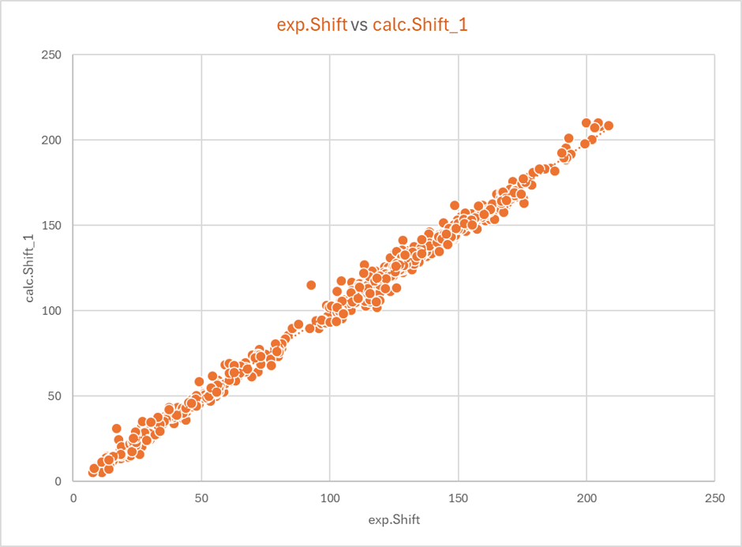
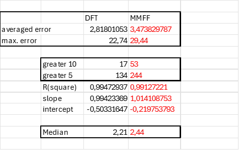
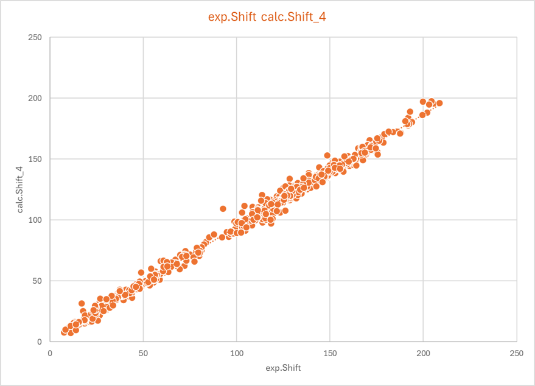
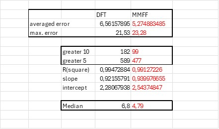
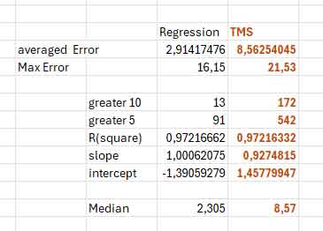

# Testcase 3

### MMFF geometries / DFT shieldings

<u>Workflow:</u>

•Geometry optimisation:UB3lyp geometries from the CASCADE people ([patonlab/CASCADE: CAlculation of NMR Chemical Shifts using Deep LEarning](https://github.com/patonlab/CASCADE))

•NMR: Shieldings using pyscf and B3LYP/6-31G*

•Calibration

​	•CSHESHIRE without Solvent (calc_Shift_1)

​	•… with CDCl3 and method SMD (calc_Shift_2)

​	•… with CDCl3 and method CPCM/UAKS (calc_Shift_3)

​	•Using TMS as reference (calc_Shift_4)

•Adding more atom descriptors (950 atoms):

​	•Hybridisation

​	•Direct bonded S (32),Cl (11),Br (0)

​	•Is chiral? (62)

​	•Is aromatic? (466)

​	•Gasteiger-Charge

•Results are directly stored into a [excel-sheet](DFT-testdaten.xlsx)

#### Results

The following image again shows the representation of the experimental shift values against those calculated using the regression model. The second representation displays the statistical metrics in comparison to the data when using the Merck force field for geometry optimization.

We see here, especially in the number of errors greater than 10 ppm and greater than 5 ppm, a significant reduction. The MAE also decreases from 3.47 to 2.82 ppm. However, the impact on the median is not as drastic; it drops from 2.44 to 2.21 ppm. The next two figures show the analogous results for TMS as a reference for the shift calculation. Here, too, a similar trend in large errors greater 10ppm is observed compared to the Merck force field. However, the errors greater than 5 ppm increase slightly. The median increases significantly, for which I currently have no explanation (I must admit I haven't looked into it intensively yet).

Here, I have once again differentiated by hybridization. For sp² carbon atoms, the referencing with TMS performs significantly worse than the regression variant. Therefore, I will prefer the regression variant (according to Tantillo) in the future. It gives a more cohesive impression. I still have the idea of a neural network for converting shielding terms into chemical shifts in mind, but I am currently unsure if that might be too complicated. 

I would have liked to include the neural network from CASCADE as well; however, the original was implemented with TensorFlow. The TensorFlow library is now in version 2, which is not fully compatible with version 1. Despite some appeals for help, including to authors who created a branch with TensorFlow 2, I have not been able to load the trained networks so far.

#### Files

[nmr-shift5g-from-smiles.ipynb](nmr-shift5g-from-smiles.ipynb) is the jupyter notebooks as used with german comments and a short sound at the end of all calculations.

[DFT-testdaten.xlsx](DFT-testdaten.xlsx) is the excel sheet with diagrams an analysis
