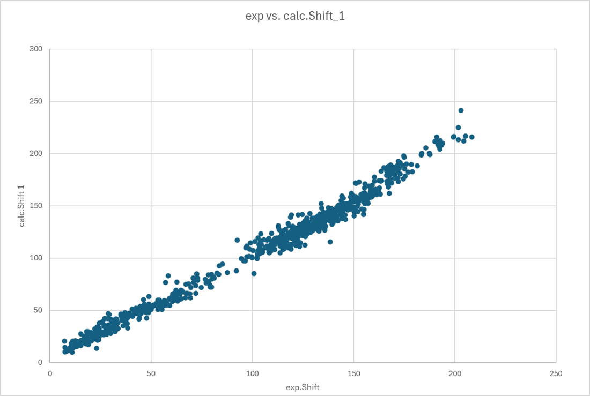
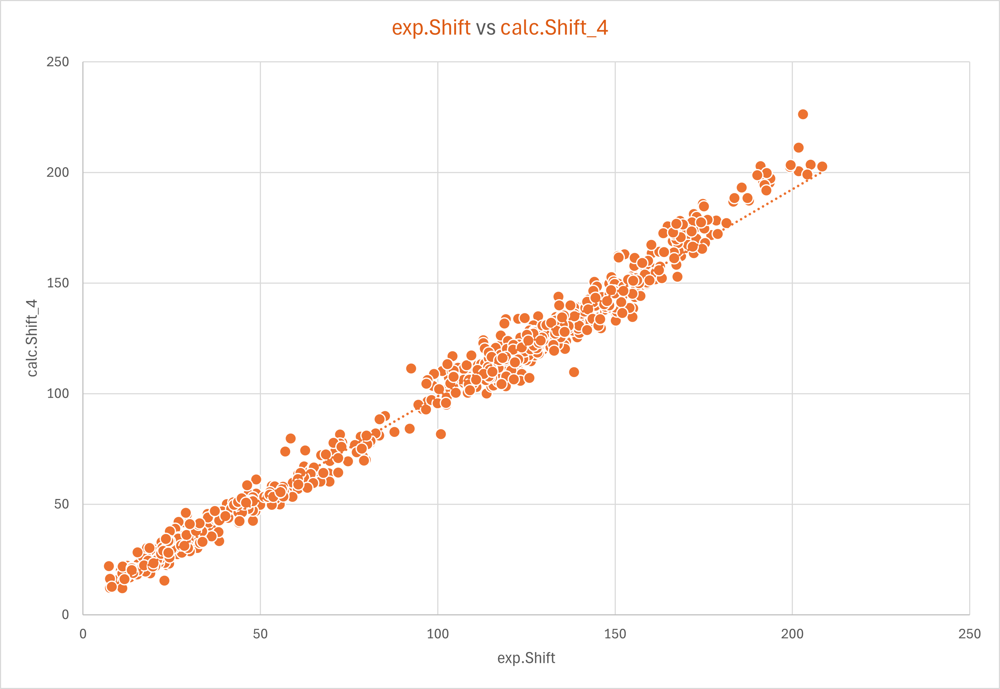

# Testcase 1

### UFF geometries / DFT shieldings

<u>Workflow:</u>

•Geometry optimisation: Universal forcefield as implemented in rdkit

•NMR: Shieldings using pyscf and B3LYP/6-31G*

•Calibration

​	•CSHESHIRE without Solvent (calc_Shift_1)

​	•… with CDCl3 and method SMD (calc_Shift_2)

​	•… with CDCl3 and method CPCM/UAKS (calc_Shift_3)

​	•Using TMS as reference (calc_Shift_4)

•Results are directly stored into a [excel-sheet](UFF-testdaten1.xlsx)

#### Results

**experimental versus calculated chemical shifts (regression method - Tantillo et. al)**

The Mean Absolute Error (MAE) is about 5.13ppm for this very simple geometry optimisation.

**experimental versus calculated chemical shifts ( TMS calibration)**

In this case the MAE is 5.37ppm.

In both cases, the observed error is outside the proposed acceptable range of 2-2.5 ppm. Nevertheless, it is remarkable that such interesting results were achieved with this simple method of geometry optimization.

[uff- nmr-shift-gpu-from-sdf.ipynb](uff-nmr-shift-gpu-from-sdf.ipynb) is an example workbook using <u>gpu</u> computing and without excel integration. ( i have changed the original notebook for the use with MMFF)

[testmappe1.xlsx](testmappe1.xlsx) is an example for an excel sheet with some results

[UFF-testdaten1.xlsx](UFF-testdaten1.xlsx) contains the data and diagrams used above

