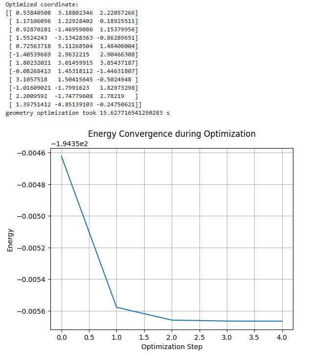
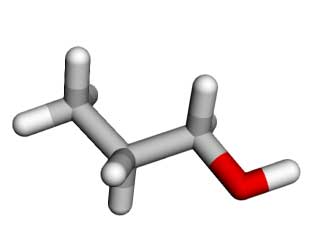
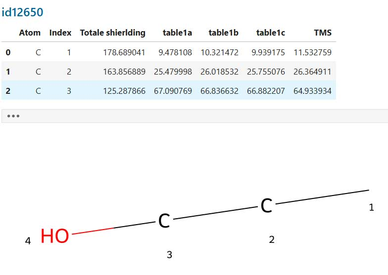

# Hybrid- DFT (B3Lyp): from SMILES to NMR chemical shifts

All results shown and discussed here were realized using the Jupyter notebook [nmr-shift5g-from-smiles.ipynb](notebook nmr-shift5g-from-smiles.ipynb). The notebook has now been commented in English and tested with the example of propanol. In its current form, it requires a functioning installation of gpu4pyscf. However, it should also be adaptable to the simpler variants of pyscf with a few changes. Only minor modifications are needed for this. I have not tested the multiprocessor version of pyscf, as I currently favor GPU computing. This is particularly related to the rapid development in the field of AI, where powerful GPU systems and possibly soon NPU will be available. Their mathematical capabilities are usually significantly higher than those of a CPU, which has to be more of a multitasker.

## How this scipt work

In addition to rdkit, pyscf, and gpu4pyscf, you will also need numpy, py3dmol, and matplotlib as libraries for displaying graphics, tables, and plots. In the first code block after all the import statements, you must enter the SMILES code of the desired molecule. Additionally, the parameter randomKoords can be set to true or false, depending on whether you want to start with random initial coordinates. More details can be found in the rdkit documentation for the function AllChem.EmbedMolecule().

In the force field pre-optimization section, you can specify the maximum number of iterations per optimization step and the maximum number of steps (40 is the default). This optimization runs such that a force field optimization is first performed with the maximum number of iterations. If no successful optimization occurs, another loop will attempt to achieve this. Each of these steps is carried out with the maximum number of iterations. According to the defaults, this would be 40 * 200 iteration steps. This should generally be more than sufficient for generating the starting geometry.

In the current version, the program generates a series of temporary files that are not automatically deleted. These are created in the subdirectories logs and xyz. These should be present to avoid runtime errors. At the end of the first code block, the starting geometry generated with the force field is saved as an xyz file. This will then be read into pyscf (later).

> in a successful case you should see something like this:
>
> ```
> Optimization with force field successful
> Number of force field iterations: 0
> XYZ-files xyz/id12650.xyz succesful written.
> ```


In the next code block, various parameters for the optimization can be set.

> mol = pyscf.M(atom=xyzfile, basis='6-31g*', output=logfile)
> mf_GPU = rks.RKS(mol, xc='b3lyp').density_fit()
> mf_GPU.disp = 'd3bj'
> mf_GPU.grids.level = 3
> mf_GPU.conv_tol = 1e-10   # 1e-10 in original example
> mf_GPU.max_cycle = 50   # 50 in original example

The default basis set is set to 6-31G* and the method to b3lyp. Additionally, there are values for tolerance and the number of cycles. The values taken from the documentation are noted again in the comments, allowing for some variation here. A module called geomeTRIC may also be necessary.

When all prerequisites are met, the geometry optimization starts. A variety of data is output during this process. At the end, the program writes the xyz coordinates of the optimized geometry and creates a plot of the energy convergence during the optimization process. The following picture is an example for the output.



In the next steps the program will be save the xyz- coordinates of the optimized structure and create a 3D plot of this.



The following code block realize the nmr shift calculation. b3lyp and 6-31g* are the choose basis set and method. For this combination the regression parameter are encoded in the next step.

> mol = pyscf.M(atom=xyzout, basis='6-31g*', output=logfile2)
> mf = dft.RKS(mol)
> mf.xc = 'b3lyp'
> mf.kernel()
> tensor = eval_shielding(mf)


In the next steps, the program will generate a table with the results of the shift calculation and a 2D representation of the molecule with numbers at the carbon atoms.




The [following pages](results_1.md) show a series of results where different parameters of the geometry optimization were varied.