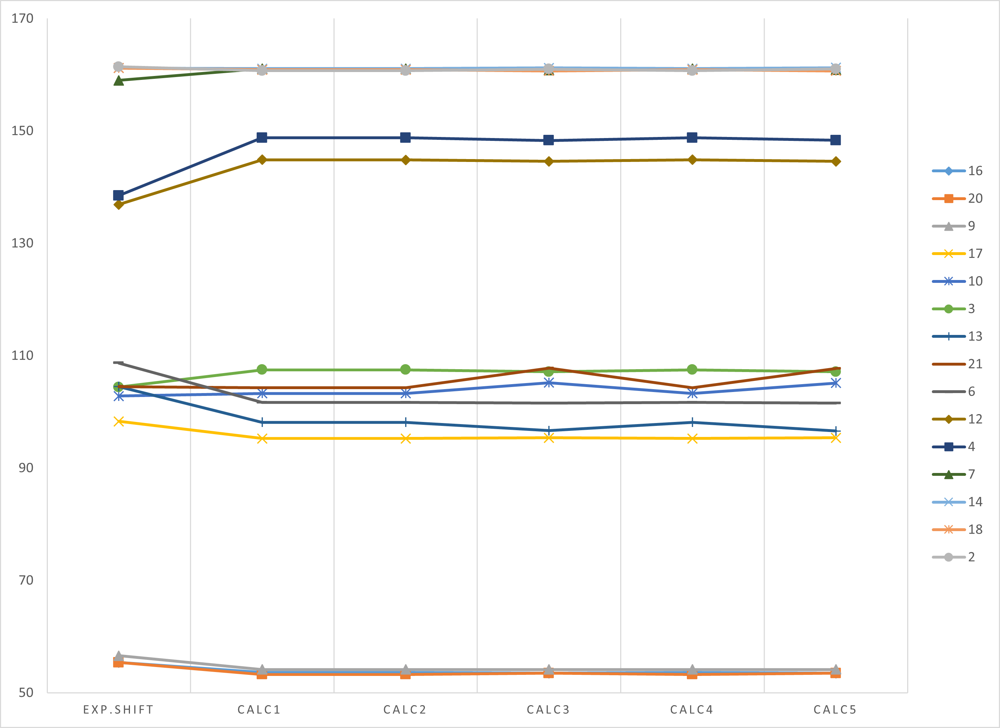

# Variation and Test of some parameters for geometry optimizations using pyscf

## Testcase 1

This compound (5-chloro-2-(3,5-dimethoxyphenyl)sulfanyl-3-methoxyphenol) was utilized as the initial test case. For five distinct calculation types, the following results were obtained (the differences among these calculations will be elaborated upon later in this document).

The NMRShiftID of this compound is: 20041829.

All chemical shifts are in ppm!

| C-Atom | exp.Shift | calc1  | calc2  | calc3  | calc4  | calc5  |
| ------ | --------- | ------ | ------ | ------ | ------ | ------ |
| 16     | 55,4      | 53,63  | 53,63  | 53,48  | 53,63  | 53,48  |
| 20     | 55,4      | 53,26  | 53,26  | 53,5   | 53,26  | 53,5   |
| 9      | 56,6      | 54,16  | 54,16  | 54,15  | 54,16  | 54,15  |
| 17     | 98,3      | 95,25  | 95,25  | 95,39  | 95,25  | 95,38  |
| 10     | 102,8     | 103,28 | 103,28 | 105,19 | 103,28 | 105,12 |
| 3      | 104,4     | 107,49 | 107,49 | 107,13 | 107,49 | 107,12 |
| 13     | 104,5     | 98,16  | 98,15  | 96,64  | 98,16  | 96,59  |
| 21     | 104,5     | 104,29 | 104,29 | 107,76 | 104,29 | 107,7  |
| 6      | 108,7     | 101,67 | 101,68 | 101,53 | 101,67 | 101,53 |
| 12     | 136,9     | 144,86 | 144,84 | 144,59 | 144,86 | 144,59 |
| 4      | 138,5     | 148,77 | 148,78 | 148,31 | 148,77 | 148,34 |
| 7      | 159       | 161,08 | 161,09 | 160,84 | 161,08 | 160,88 |
| 14     | 161,2     | 161,08 | 161,08 | 161,23 | 161,08 | 161,24 |
| 18     | 161,2     | 160,92 | 160,92 | 160,68 | 160,92 | 160,69 |
| 2      | 161,4     | 160,71 | 160,71 | 161,01 | 160,71 | 161,03 |

The first calculation was performed using the standard parameters, which are also included in the comments in the Jupyter Notebook. The maximum number of steps was 20. This step count was increased to 50 in the second test.  

> **mol_eq = optimize(mf_GPU, maxsteps=50, callback=callback)**

In the third test, **mf_GPU.conv_tol = 1e-12** was used instead of 1e-10 as in the original example. In example 4, the maximum number of cycles was increased from 50 to 100 (**mf_GPU.max_cycle = 100**). In the last example, the convergence tolerance was changed again, this time in the opposite direction (**mf_GPU.conv_tol = 1e-8**).

Below is the progression of energy convergence for all 5 calculations.

Calculation 1:

Calculation 2:

Calculation 3:

Calculation 4:

Calculation 5:

For all 5 calculations, very similar trends emerge, both graphically and numerically. However, it is important to note that the representation using matplotlib can be somewhat unconventional (see the baseline of the y-axis in the upper left of the figures) and that no random starting coordinates were chosen for the pre-optimization with the force field (which is standard for the function AllChem.EmbedMolecule()). The use of random coordinates was only introduced later in the subsequent tests.

The next figures now show the effects on the calculated chemical shifts. First as a total representation and then split into different areas for better clarity.

Zoom 1:

For the two chemically equivalent carbon atoms 16 and 20, there are swaps in the calculated values. However, due to their isochrony, these swaps are not relevant for assigning experimental data from calculated data. Nevertheless, this already reveals a problem: whether and, if so, how chemical equivalence can be determined in an automated process.

Zoom 2:

In the range between 94 and 110 ppm, the representation becomes somewhat less clear. I will try to categorize the results a bit. Carbon atoms 13 and 21 are again chemically equivalent, meaning they are isochronous. These correspond to the brown line (C-21) and the blue line with crosses (C-13). The experimental chemical shift is at 104.5 ppm. (Carbon atom 3 has a very similar shift at 104.4 ppm and is represented as a green line with green dots in the figure). Therefore, it is interesting to take a look at the optimized 3D structures. The following figure shows this structure for calculation 5 (all xyz files are stored in the subdirectory xyz). I created the representation using ChimeraX, and since the numbering is unfortunately not consistent, I determined which atom is which based on the coordinates and noted this in the figure.

From this figure, it is evident that C-13 lies in the shielding region of the anisotropy cone of the second benzene ring and is therefore shifted to lower ppm values compared to C-21. This effect is clearly visible here, as theoretical calculations show the molecule in its structure as a snapshot. I manually calculated the average of both data points and arrived at values of 101.22, 101.22, 102.2, 101.22, and 102.14 ppm for the respective calculations. These values are consistently lower than the calculated value for C-3; however, the experimental values only differ by 0.1 ppm, with the experimental value for C-3 being 0.1 ppm smaller. The "drop" in the calculated value for C-6 is also not particularly surprising, as literature (including works by Tantillo et al.) has reported issues with heavy atoms like chlorine. In the case of C-6, it is also noteworthy that the second ortho position carries an oxygen substituent, which is not the case for C-3.

Considering the manual averaging for C-13 and C-21 and sorting the chemical shifts in descending order, the experimental values in this range yield the sequence C-6 / C-13, C-21 / C-3 / C-10 / C-17. For calculation 5, the order is C-3 / C-10 / C-13, C-21 / C-6 / C-17. If one were to assign the experimental shifts based on this size sorting, only the assignment of C-17 would be correct.

Out of curiosity, I compared this with the license from ACDLabs held at the University of Potsdam (version 2020.1.2). The following results were obtained for the discussed range:

| C-Atom | exp.Shift | acd    |
| ------ | --------- | ------ |
| 17     | 98,3      | 99,65  |
| 10     | 102,8     | 108,12 |
| 3      | 104,4     | 110,57 |
| 13     | 104,5     | 107,59 |
| 21     | 104,5     | 107,59 |
| 6      | 108,7     | 106,6  |

Graphically, it looks as follows:

Here, sorting by size yields the following order: C-3 / C-10 / C-13, C-21 / C-6 / C-1. This exactly matches the calculated order I obtained through manual averaging for C-13 and C-21.

Zoom 3:

The last zoomed area lies between 128 and 162 ppm. Notably, there is the "wild ride" of C-7, which carries an oxygen substituent and has a sulfur atom at the ortho position of the adjacent carbon atom. Here, the so-called heavy atom effect can also cause deviations. The differences between C-14 and C-18 can be discussed in relation to their position relative to the other phenyl ring, although the effect is significantly smaller here. 

If we also calculate the average for C-14 and C-18, we obtain a rounded value of consistently 161.0 ppm in all five test calculations. When sorted in descending order, the experimental sequence is: C-2 / C-18, C-14 / C-7. For the calculated values, it would be: C-2 / C-14, C-18 / C-7 for calculation variant 5. Both sequences match, although the differences in the calculated values are very small.
