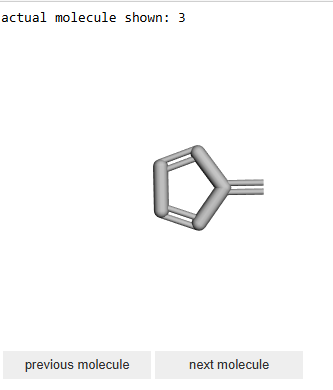

# Tools

This is a continous growing collection of short jupyter notebooks for little tasks. Can also be used as examples for implementing rdkit in jupyter notebooks.

## Molfile Viewer

[Molfile-viewer.ipynb](Molfile-viewer.ipynb) is a program to show a molecule from a MDL molfile. Shows the molecule, numbering and can optionally generate 2D coordinates from 3D coordinates for better visualizations.

## Interactive sdf- File browser

You can browse through the entries of an sdf- file. Molecules are shown in 3D.

## sdf optimizer

The sdf optimizer performs a force field optimization for all molecules in an sdf file. All optimized structures are saved in a new sdf file. It only considers valid molecules, meaning those for which the generation of the 3D starting structure and the force field optimization with the standard parameters from rdkit are successful.
